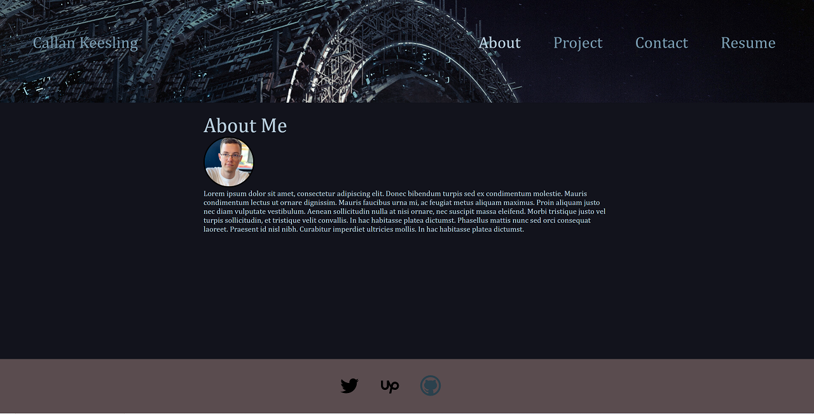
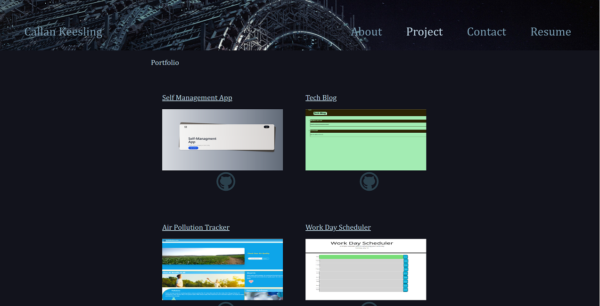
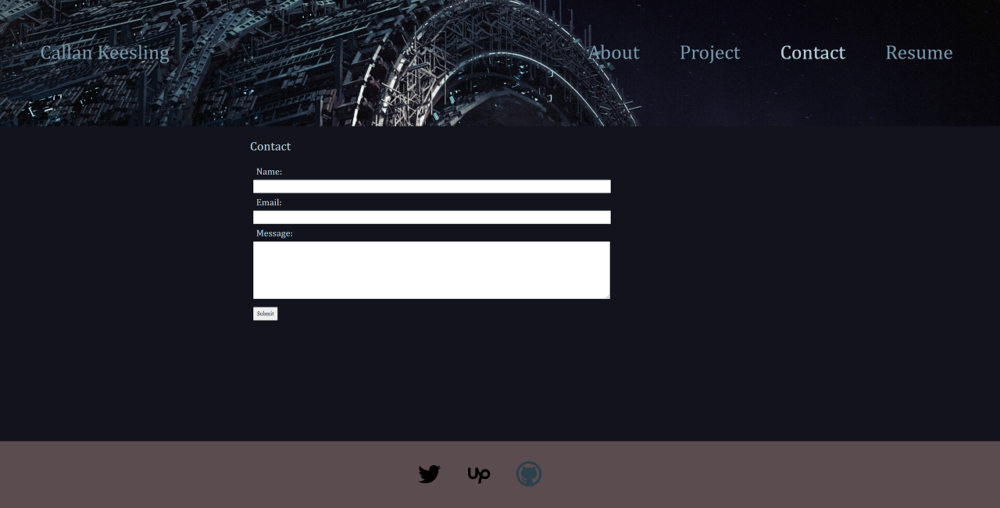
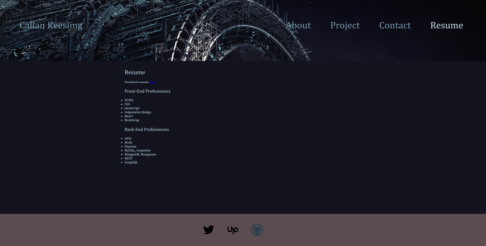

# Professional React Portfolio 

  ## Description
  
  A website dedicated to my web development work, and a further demonstration of my web development skills with the website itself being a React App. Includes an about section, a project section, a responsive contact section, and a summary resume section. Also includes links to all the featured projects in the project section, and links to my github, twitter, and upwork accounts.

  ## Table of Contents
  - [Installation](#installation)
  - [Usage](#usage)
  - [Credits](#credits)
  - [License](#license)

  ## Website

  [Portfolio](https://keesling-portfolio-website.herokuapp.com/)

  ## Built With

  - HTML
  - CSS Grid & Flex
  - JavaScript
  - React

  ## Screenshot

  
  
  
  
  ## Installation

    nothing needs to be downloaded to run this app, but I did initialize the React app using npx create-react-app command.

  ## Usage

  Use the website to display my web development work and to contact me for business inquiries.

  ## Credits

  [Callan Keesling](https://github.com/Callank21)

  ## License

  [Mozilla Public LIcense 2.0]((https://opensource.org/licenses/MPL-2.0))

